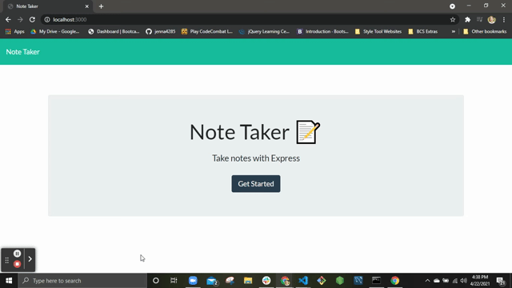

# notetaker
  ## Description:
  The notetaker app allows users to write, save, and delete notes/to-do items...etc. Simpy navigate to the website, click "Get Started", and begin entering text to replace the Title and Note body. Once complete, click the save icon! To review previously entered notes, click the note on the left side of the browser to see the note expanded. If you no longer need to store a note, simply click the delete button next to your note and your list is updated. 
  ## Table of Contents:
  - [Installation](#installation)
  - [Usage](#usage)
  - [Credits](#credits)
  - [License](#license)
  ## Install Instructions:
  Run < npm init> to create a package.json file. Once downloaded, open your package.json file and run < npm i path, npm i fs, and npm i uuid > to utilize this application.
  ## Usage:
  Follow the prompts!\
  
  ## Guidelines to Contribute:
  Please create pull requests on GitHub to contribute.
  ## Test Instructions:
  Make sure to test your code before creating a pull request.
  ## Questions:
  Link to GitHub: github.com/jenna4285
  Contact me with questions at jenna4285@yahoo.com  
